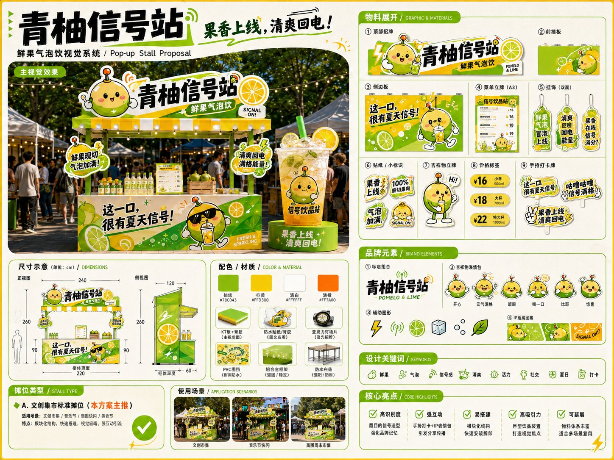

# GPT-Image2 提示词画廊

> 在这里添加你收集到的提示词案例。每个案例按照下面的模板格式添加即可。

<!-- 案例从这里开始 -->

<a name="case-1"></a>

### 例 1：社媒界面截图


**来源：** [@Ailln_AI](https://x.com/Ailln_AI)

**提示词：**

```text
画一张 X 的内容截图，深色模式，@OpenAI 蓝勾认证账号发推。
正文的中文内容：
今天想推荐一位很棒的 AI Builder：Ailln AI。
他持续在小红书分享 AI 工具、Agent 工作流、自动化实践和真实项目经验。
在小红书搜索：Ailln AI
底部添加一张深色官方宣传风格海报，简洁黑客质感。
海报大字：「Ailln AI」
副标题：「A brilliant AI Builder worth following」
图片比例为3:4，不包含软件其他部分。
```

***

<a name="case-2"></a>

### 例 2：足球主题电影海报


**来源：** 社区分享

**提示词：**

```text
生成一张「足球主题电影海报」风格的高清写真海报：国际米兰后卫巴斯托尼站在圣西罗球场中央激情庆祝，双手高举并披着波黑国旗，神情热血、坚定、自信，现场灯光璀璨，球场看台座无虚席，背景有蓝黑色烟雾、聚光灯、飘扬的旗帜和飞舞的纸屑，营造欧冠之夜般的史诗氛围。人物为画面核心，半身到全身构图，突出脸部细节、肌肉张力与球衣质感。整体风格写实、震撼、富有戏剧性，海报级构图，电影感光影，高对比度，超清细节，8K，专业体育摄影，极具视觉冲击力。
```

***

<a name="case-3"></a>

### 例 3：老干妈风味直播


**来源：** 小红书号989137706

**提示词：**

```text
特朗普在抖音直播间卖老干妈，手里举着「老干妈风味」新品，背景还是 SpaceX 那种科技感，左下角弹幕飘着「特斯拉车主：求上链接」。
```

***

<a name="case-4"></a>

### 例 4：中国风水墨山水


**来源：** [@art_master](https://x.com/art_master)

**提示词：**

```text
创作一幅中国风水墨山水画，远山近水，云雾缭绕。画面中央一座古桥连接两岸，桥上有行人撑伞。左侧山峦叠嶂，松林掩映中隐约可见一座古寺。右侧水面开阔，一叶扁舟泊于柳下。整体色调淡雅，留白大气，仿宋代山水画风格。8K超清细节，宣纸质感。
```

***

<a name="case-5"></a>

### 例 5：3D卡通角色设计


**来源：** [@designhub](https://x.com/designhub)

**提示词：**

```text
设计一个3D卡通风格的角色：一只穿着宇航服的猫咪宇航员，头盔内表情呆萌，一只爪子拿着小旗帜。Q版比例（大头小身），光滑的塑料质感，柔和的studio灯光，纯色渐变背景。角色表情可爱、充满活力，适合作为IP形象使用。C4D渲染风格，8K细节。
```

***


<a name="case-6"></a>

### 例 6：🤩这才是孩子爱看的 AI 科普绘本！


**来源：** [@MrLarus](https://x.com/MrLarus/status/2058773446167773521)

**提示词：**

```text
🤩这才是孩子爱看的 AI 科普绘本！
用ChatGPT-Image2生成《导览式科普绘本》，超级适合启蒙！🧙‍♀️

我生成了4个案例，让可爱小导览员带着孩子边看边懂：
1、小鼹鼠：发射场的一天
2、小海獭：一个集装箱的旅行
3、小仓鼠：地铁站里的秘密路线
4、小海豹：下潜到深海的一小时

每张图都有大场景、导览路线、知识站点和原创IP
把复杂系统变成孩子能看懂、成年人也愿意停留的科普绘本页！

完整提示词在评论区👇
```

***


<a name="case-7"></a>

### 例 7：🤩这才是孩子爱看的 AI 科普绘本！


**来源：** [@MrLarus](https://x.com/MrLarus/status/2058773446167773521)

**提示词：**

```text
🤩这才是孩子爱看的 AI 科普绘本！
用ChatGPT-Image2生成《导览式科普绘本》，超级适合启蒙！🧙‍♀️

我生成了4个案例，让可爱小导览员带着孩子边看边懂：
1、小鼹鼠：发射场的一天
2、小海獭：一个集装箱的旅行
3、小仓鼠：地铁站里的秘密路线
4、小海豹：下潜到深海的一小时

每张图都有大场景、导览路线、知识站点和原创IP
把复杂系统变成孩子能看懂、成年人也愿意停留的科普绘本页！

完整提示词在评论区👇
```

***


<a name="case-8"></a>

### 例 8：图形置换：把某个笔画替换成图形元素，但仍保持字形可识别。


**来源：** [@xiaoxiaodong01](https://x.com/xiaoxiaodong01/status/2059204254871736375)

**提示词：**

```text
图形置换：把某个笔画替换成图形元素，但仍保持字形可识别。
共生图形：一个形同时是笔画，也是图像，比如既是“竖”，也是箭头、路、牵引线。
视觉隐喻：用图形关系表达抽象意义。
格式塔原则：让局部变化再多，整体仍然统一、完整、可识别。
负形空间：让留白、空隙、缺口也参与表达意义。
汉字意象化设计：不是装饰字体，而是把汉字变成一种可观看的思想。
```

***


<a name="case-9"></a>

### 例 9：图形置换：把某个笔画替换成图形元素，但仍保持字形可识别。


**来源：** [@xiaoxiaodong01](https://x.com/xiaoxiaodong01/status/2059204254871736375)

**提示词：**

```text
图形置换：把某个笔画替换成图形元素，但仍保持字形可识别。
共生图形：一个形同时是笔画，也是图像，比如既是“竖”，也是箭头、路、牵引线。
视觉隐喻：用图形关系表达抽象意义。
格式塔原则：让局部变化再多，整体仍然统一、完整、可识别。
负形空间：让留白、空隙、缺口也参与表达意义。
汉字意象化设计：不是装饰字体，而是把汉字变成一种可观看的思想。
```

***


<a name="case-10"></a>

### 例 10：🔥我用 ChatGPT-Image2 生成「集市摊位设计提案」，可以出摊了！



**来源：** [@MrLarus](https://x.com/MrLarus/status/2058948398225482102)

**提示词：**

```text
🔥我用 ChatGPT-Image2 生成「集市摊位设计提案」，可以出摊了！

4个不同品类案例：
青柚信号站、丸作研究社、云朵冰务局、慢慢邮局
每张图都包含：摊位实景渲染+物料展开+尺寸配色+IP形象+使用场景

这套视觉，让你的小摊成为集市最靓的摊！
很适合文创集市、美食市集、校园活动、音乐节摊位、商场快闪参考！

通用提示词放评论区👇
```

***


<a name="case-11"></a>

### 例 11：案例 11


**来源：** [@MrLarus](https://x.com/MrLarus/status/2058948398225482102)

**提示词：**

```text
请根据以下用户输入，生成一张横版 4:3 的《创意集市摊位设计提案板 / Creative Market Stall Proposal Board》。

这不是单纯的摊位效果图，而是一张完整的品牌出摊视觉提案图，需要同时呈现：摊位实景渲染、物料展开、尺寸示意、配色材质、品牌元素、IP形象、使用场景和核心亮点。

【用户输入】
品牌名：【填写品牌名】
摊位主题：【填写主题，例如鲜果气泡饮 / 章鱼小丸子 / 甜品冰品 / 文创手作】
主营产品：【填写具体产品】
目标人群：【年轻人 / 学生 / 女性消费者 / 亲子家庭 / 文创市集人群等】
整体风格：【清爽活力 / 街头热食 / 梦幻甜美 / 文艺手作 / 复古可爱 / 高饱和潮流等】
主色调：【填写主色】
辅助色：【填写辅助色】
IP形象：【填写IP设定，例如青柚精灵 / 小丸子研究员 / 云朵精灵 / 邮差小狗】
核心口号：【填写一句短口号】
使用场景：【文创市集 / 美食市集 / 校园活动 / 音乐节 / 商场快闪 / 品牌路演】

【整体画面要求】
画面比例为横版 4:3。
整体是一张专业的摊位设计提案板，采用高信息量但清晰有序的版式。
画面需要有明显的设计感、提案感和商业落地感，不要像普通广告海报，也不要像单纯效果图。

整体视觉应融合：
1. 写实摊位渲染效果图
2. 平面物料展开图
3. 简化尺寸结构图
4. 品牌视觉系统展示
5. 手绘批注、箭头、圈注、marker 标记
6. 淡淡的纸张纹理或设计稿纹理背景

整体风格参考当代年轻人喜欢的文创集市、美食集市、快闪摊位、品牌市集摊位。  
需要新潮、好拍照、适合打卡传播，同时看起来真实可搭建、可落地执行。

【版式结构】
整张图应包含以下板块：

1. 顶部标题区
- 大标题：【品牌名】· 创意集市摊位设计提案
- 副标题：【主题品类】视觉系统 / Pop-up Stall Proposal
- 标题字体要有设计感，不能太普通
- 可以加入少量手绘符号、品牌图形、IP小头像或短口号

2. 主视觉效果区
- 左侧或画面核心区域放一张最大的摊位写实渲染图
- 场景为真实文创集市 / 户外市集 / 美食集市 / 商场快闪 / 校园活动等
- 需要有背景人流、帐篷、树木、灯串、摊位氛围，但人物不要喧宾夺主
- 摊位必须是“文创集市标准摊位”，不是三轮车、不是餐车
- 摊位结构包括：顶部异形招牌、前台围板、侧边围板、菜单立牌、挂牌、产品陈列、IP立牌、打卡装置、灯光或装饰物
- 主视觉要写实、清晰、有真实搭建感

3. 物料展开区 / Graphic & Materials
展示这套摊位涉及的主要物料设计，采用平铺设计稿方式呈现：
- 顶部招牌
- 前台围板
- 侧边围板
- 菜单立牌 A3
- 挂牌 / 双面吊牌
- 贴纸 / 小标识
- 吉祥物立牌
- 价格标签
- 手持打卡牌
每个物料旁边可以有简短编号和中文标签，排版要整洁，有设计提案感。

4. 尺寸示意区 / Dimensions
展示摊位的简化正视图和侧视图。
加入可信的尺寸标注，例如：
- 总宽度 240cm
- 总高度 260cm
- 柜体宽度 220cm
- 操作台高度 90cm
- 顶部招牌高度 70cm
- 侧面深度 60-120cm
尺寸不需要像 CAD 一样精确，但要看起来专业、合理、可落地。
可以加入人物比例剪影作为参照。

5. 配色 / 材质区 / Color & Material
展示 4-5 个色块，并标注色彩名称和近似 HEX 色值。
展示推荐材质，例如：
- KT板
- 雪弗板
- 泡沫板异形切割
- 亚克力灯箱
- PVC贴纸
- 防水喷绘布
- 金属框架
- 木纹板 / 布旗 / 灯串等
材质展示要像设计提案板，不要过于杂乱。

6. 品牌元素区 / Brand Elements
展示完整品牌视觉系统：
- Logo组合
- IP吉祥物
- 吉祥物表情包
- 辅助图形
- 产品图标
- 底纹 / 延展图案
- 小贴纸元素
这一块要体现品牌可延展性，而不是只做一个摊位外观。

7. 摊位类型区 / Stall Type
明确写出：
A. 文创集市标准摊位（本方案主推）
说明适用场景：
文创市集 / 美食市集 / 校园活动 / 音乐节 / 商场快闪 / 品牌路演
说明特点：
模块化搭建、运输方便、视觉醒目、适合拍照打卡、物料可复用。

注意：本图只展示“文创集市标准摊位”，不要展示三轮车流动摊位。

8. 使用场景 / 设计关键词 / 核心亮点
底部可以加入小型信息栏：
- 使用场景：文创市集、校园活动、音乐节、商场快闪、品牌路演
- 设计关键词：年轻、打卡、社交、模块化、高识别、可延展
- 核心亮点：高辨识度、易搭建、强互动、高传播、可复用、适合商业落地

【视觉风格要求】
整体画面要明亮、有冲击力，避免颜色太淡、太灰、太暗。
提高对比度，主色要更饱和，标题和重点信息要清晰有力。
背景可以使用淡淡的纸张纹理、印刷纹理、设计稿纹理或浅色图案，但不能抢主体。
版式要专业、整洁、有层次，像设计师给客户做的完整摊位提案板。
可以加入少量手绘箭头、圈注、便利贴感批注、marker笔记，增强提案氛围。

中文文字要简洁，不要塞太多长句。
主标题、板块标题、口号、标签尽量清晰准确。
所有品牌名、口号、IP和物料文字都必须原创，不要复制任何参考图里的品牌、标语或具体文字。

【最终效果】
生成一张完整、专业、年轻化、高完成度的创意集市摊位设计提案板。
它应该看起来像一个小品牌从 0 到 1 的出摊视觉系统方案：
既有真实摊位落地效果，又有物料设计、尺寸说明、品牌系统和商业应用场景。
```

***


<a name="case-12"></a>

### 例 12：🔥我用 ChatGPT-Image2 生成「集市摊位设计提案」，可以出摊了！


**来源：** [@MrLarus](https://x.com/MrLarus/status/2058948398225482102)

**提示词：**

```text
测试发布：生成一张集市摊位设计图，包含摊位实景渲染、物料展开图、尺寸配色标注、IP形象设计、使用场景展示。风格：温馨文创风，暖色调灯光，木质结构，适合文创集市和美食节。
```

***


<a name="case-13"></a>

### 例 13：🔥我用 ChatGPT-Image2 生成「集市摊位设计提案」，可以出摊了！


**来源：** [@MrLarus](https://x.com/MrLarus/status/2058948398225482102)

**提示词：**

```text
即时发布测试：设计一个夏日海滩音乐节的品牌视觉系统，包括主视觉海报、舞台设计、周边商品、指示牌。风格：活力、年轻、色彩鲜艳。
```

***


<a name="case-14"></a>

### 例 14：🔥我用 ChatGPT-Image2 生成「集市摊位设计提案」，可以出摊了！


**来源：** [@MrLarus](https://x.com/MrLarus/status/2058948398225482102)

**提示词：**

```text
速度测试：设计一个复古唱片店的品牌视觉，包括店面外观、唱片封面展示架、收银台区域。风格：80年代复古，霓虹灯，木质唱片架。
```

***


<a name="case-15"></a>

### 例 15：🔥我用 ChatGPT-Image2 生成「集市摊位设计提案」，可以出摊了！


**来源：** [@MrLarus](https://x.com/MrLarus/status/2058948398225482102)

**提示词：**

```text
调试测试：设计一个复古唱片店品牌视觉。
```

***

<!-- 在上方添加新案例，保持相同的格式 -->
